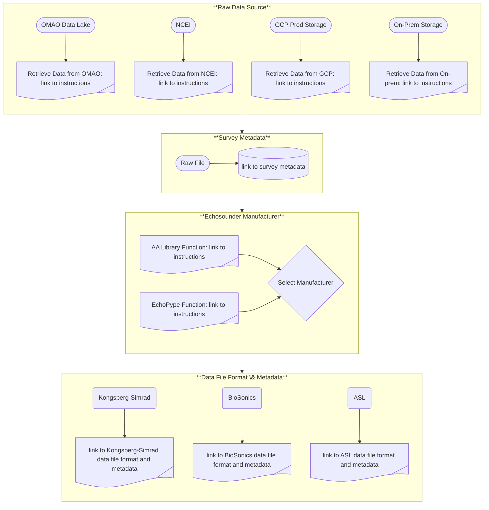

# AA-SI_DataRoadMap
Our data road map is based on echoPype's data processing levels <a href="https://echolevels.readthedocs.io/en/latest/levels_proposed.html"> "echoPype processing levels"</a>, where each level represents a step from "raw" data in manufacturer-specified file formats to gridded data that are ready for input to advanced analytical models, such as, machine learning (ML), artificial intelligence (AI), Bayesian inverse (APES), and other advanced statistical models. Active acoustic data (echosounder, SONAR, multibeam) are our primary data set, but we include supplemental data, such as oceanographic, biological, and geological data that describe the environment, as well as metadata for all data streams.

For the AA-SI, we define the levels as:  
- **Level 0**
    - Input: raw data file in manufacturer-specified format located in the cloud or on-premise,
    - Harvest survey-level metadata (who, what, when, where, why, and how) the data were collected,
    - Determine the echosounder manufacturer,
    - Determine the acquistion hardware and software used to record the data,
    - Harvest file-level metadata (CW or FM mode, number of channels, ...),
    - Output: survey-level and file-level metadata.
- **Level 1**
    - Input: Level 0 data
    - Harvest all ancillary data (e.g., motion, GPS, sound speed, attenuation, ...) contained within the level 0 file,
    - Determine whether supplemental data are required (e.g., missing GPS), and if so, assemble those data,
    - reformat manufacturer-specified-format data to open-format data (<a href="https://htmlpreview.github.io/?https://github.com/ices-publications/SONAR-netCDF4/blob/master/Formatted_docs/crr341.html"> "ICES SONAR-netCDF4" format),
    - Collate all calibration data and metadata,
    - Output: Open-format data with all supplemental information to be used in subsequent processing.
- **Level 2**
    - blah
- **Level 3**
    - blah

Level 0 data are survey-level and file-level metadata and the raw data file.
