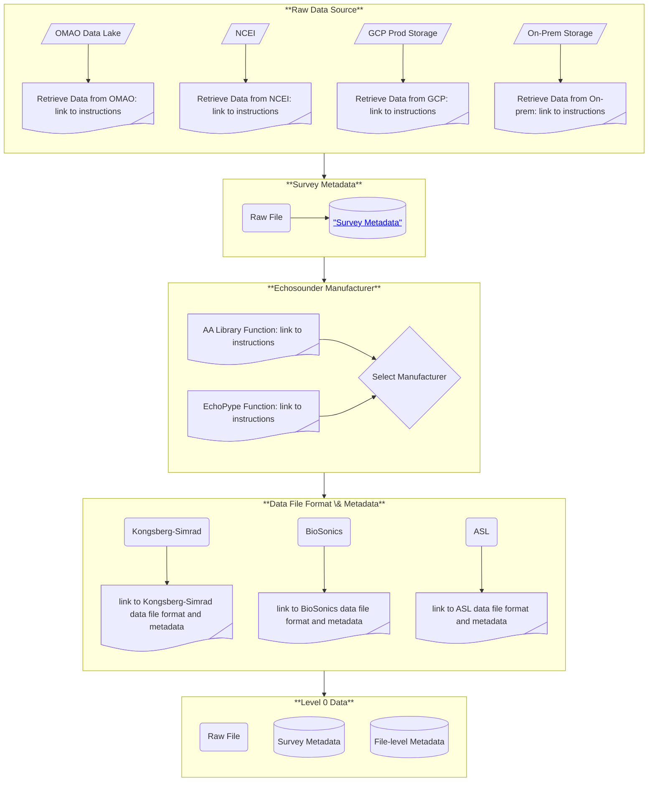
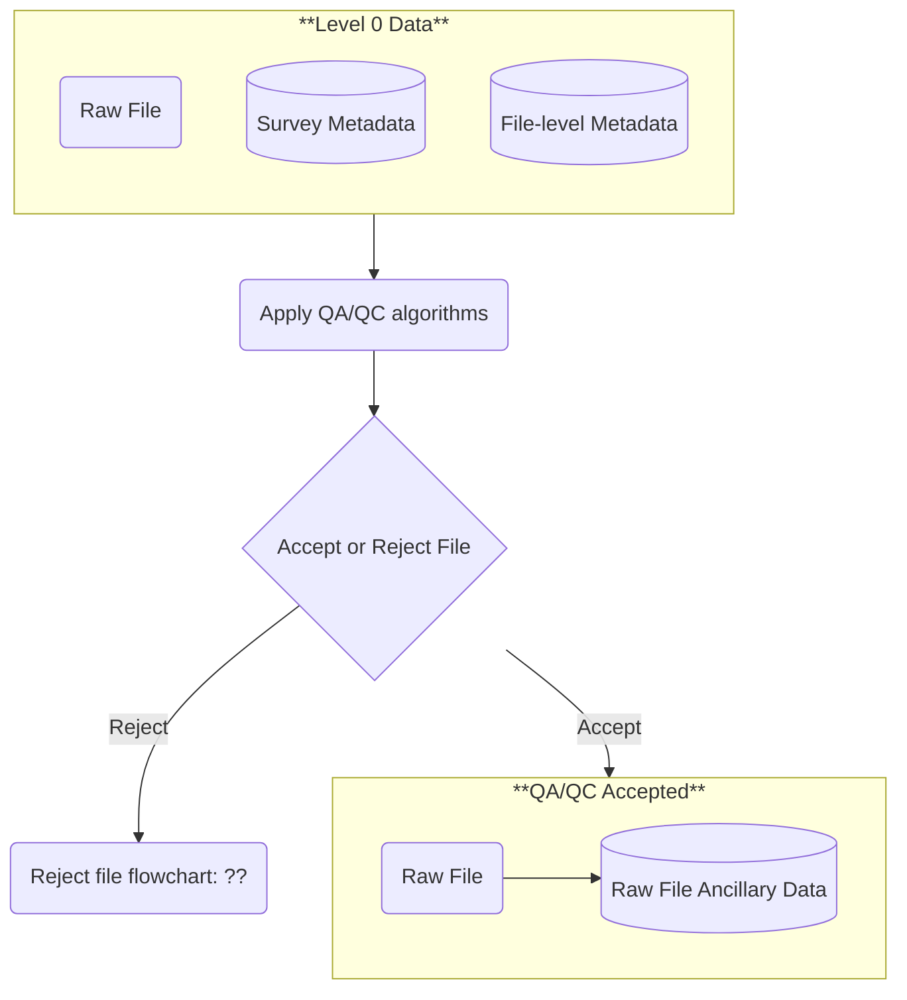

# AA-SI Data Road Map
The AA-SI is developing a data pipeline to store, process, and analyze data, and generate products for fisheries management. By necessity, this pipeline will be in the AA-SI's storage and computing environment  with GCP. One of the goals of this pipeline is to automate as much as we can so that we can effectively and efficiently address the growing data volume that we record and store.  

Our data road map is based on echoPype's data processing levels <a href="https://echolevels.readthedocs.io/en/latest/levels_proposed.html"> "echoPype processing levels"</a>, where each level represents a step from "raw" data in manufacturer-specified file formats to gridded data that are ready for input to advanced analytical models, such as, machine learning (ML), artificial intelligence (AI), Bayesian inverse (APES), and other advanced statistical models. Active-acoustic data (echosounder, SONAR, multibeam) are our primary data set, but we include supplemental data, such as oceanographic, biological, and geological data that characterize the environment, as well as metadata for all data streams.

For the AA-SI, we define the levels as:  
- **Level 0**
    - Input: raw data file in manufacturer-specified format located in the cloud or on-premise,
    - Harvest survey-level metadata (who, what, when, where, why, and how) for the selected data,
    - Determine the echosounder manufacturer - this is the first step towards determining the file format,
    - Determine the acquistion hardware and software used to record the data - this determines the file format,
    - Harvest file-level metadata (CW or FM mode, number of channels, ...),
    - Output: survey-level and file-level metadata.
- **Level 1**
    - Input: Level 0 data - raw data file, survey-level, and file-level metadata,
    - Apply quality assurance (QA)/quality control (QC) criteria,
    - Harvest all ancillary data (e.g., motion, GPS, sound speed, attenuation, ...) recorded within the level 0 raw data file,
    - Determine whether supplemental data are required (e.g., missing GPS), and if so, assemble those data,
    - Reformat manufacturer-specified-format active-acoustic data to open-format (<a href="https://htmlpreview.github.io/?https://github.com/ices-publications/SONAR-netCDF4/blob/master/Formatted_docs/crr341.html"> "ICES SONAR-netCDF4"</a>) format,
    - Reformat supplemental data to open-format, 
    - Collate validated calibration data and metadata for supplemental data,
    - Output: Open-format, SONAR-netCDF4 for active-acoustic data, data with supplemental data and metadata to be used for processing the active-acoustic data.
- **Level 2**
    - Input: Level 1 data - files in open data formats,
    - Apply missing ancillary data (e.g., missing GPS),
    - Apply motion, sound-speed, and attenuation corrections,
    - Apply validated calibration data,
    - Apply noise-reduction (impulse, transient, background noise) algorithms,
    - Apply noise-reduction lines and regions - e.g., bubble exclusion, seabed echo exclusion, instrument exclusion (e.g., CTD echo),
    - Format active-acoustic data to echoPype, <a href="https://xarray.dev/"> "xArray"</a> based, format, 
    - Output: Calibration-verified, noise-reduced active-acoustic data in echoPype format at native resolution
- **Level 3**
    - Input: Level 2 data,
    - Grid the active-acoustic data at the selected spatial and/or temporal grid resolution,
    - Provide validated data at the equivalent grid resolution,
    - Output: Data ready for ingest to advanced AI/ML and analytical models
- **Level 4**
    - TBD - AI/ML models

## Level 0 Data

Level 0 data are survey-level and file-level metadata and the raw data file.

# Level 1 Data

