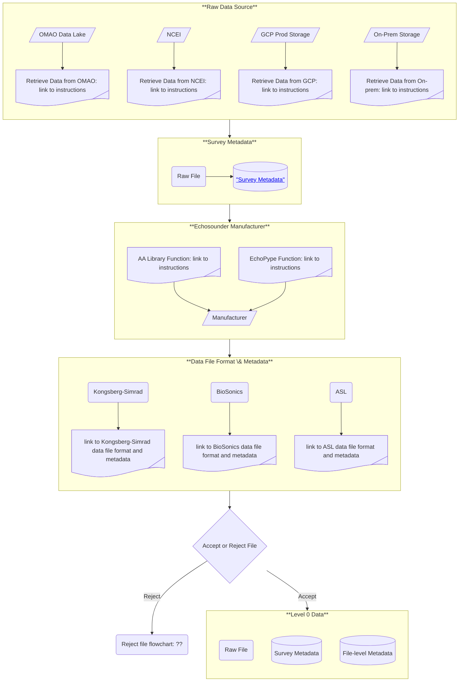
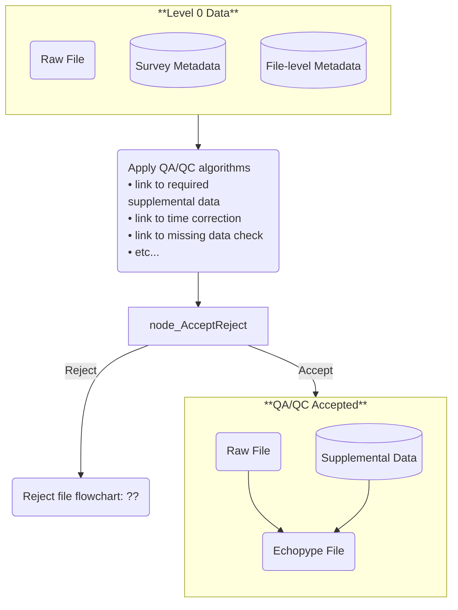

# AA-SI Data Road Map
The AA-SI is developing a data pipeline to store, process, and analyze data, and generate products for fisheries management. By necessity, this pipeline will be in the AA-SI's storage and computing environment  with GCP. One of the goals of this pipeline is to automate as much as we can so that we can effectively and efficiently address the growing data volume that we record and store.  

Our data road map is based on echoPype's data processing levels <a href="https://echolevels.readthedocs.io/en/latest/levels_proposed.html"> "echoPype processing levels"</a>, where each level represents a step from "raw" data in manufacturer-specified file formats to gridded data that are ready for input to advanced analytical models, such as, machine learning (ML), artificial intelligence (AI), Bayesian inverse (APES), and other advanced statistical models. Active-acoustic data (e.g., echosounder, SONAR, multibeam) are our primary data set, but we include supplemental data, such as oceanographic, biological, and geological data that characterize the environment, as well as metadata for all data streams.

For active acoustic data, we define the levels and processes within those levels as:  
- **Level 0**  
    - **Input:** raw data file in manufacturer-specified format located in the cloud or on-premise 
    - **Processes:**  
      - Harvest survey-level metadata (who, what, when, where, why, and how) for the selected data, 
      - Determine the echosounder manufacturer, 
      - Determine the acquistion hardware and software used to record the data, 
      - Harvest file-level metadata (e.g., number of channels, ...). 
      - Harvest ping-level metadata (e.g., CW or FM, active or passive, ...) 
    - **Output:**  
      - survey-level metadata 
      - file-level metadata 
      - ping-level metadata  
- **Level 1** 
    - **Input:** Data from Level 0 
      - raw data file 
      - survey-level metadata 
      - file-level metadata 
      - ping-level metadata 
    - **Level 1A** 
      - **Processes**: 
        - Determine whether sufficient GPS data are recorded in the raw data file, 
        - Harvest supplemental data (e.g., motion, GPS, sound speed, attenuation, ...) recorded within the level 0 raw data file, 
    - **Level 1B** 
      - **Processes**: 
        - Apply quality assurance (QA)/quality control (QC) criteria, 
          - Merge supplemental data if needed (e.g., GPS), 
          - Apply time-coordinate corrections, 
          - Apply motion correction, 
          - Other QA/QC? 
        - Reformat manufacturer-specified-format active-acoustic data to "Echopype" and/or <a href="https://htmlpreview.github.io/?https://github.com/ices-publications/SONAR-netCDF4/blob/master/Formatted_docs/crr341.html"> "ICES SONAR-netCDF4"</a> open formats, 
    - **Output:** Data files in open-source formats 
      - The default is Echopype format, which we use as input to L2 and higher.  
      - Strict sonarNET-CDF4 format for coordination with other national and international groups. 
      - Supplemental data and metadata to be used for processing the active-acoustic data.   
- **Level 2**  
    - **Input:**  
      - Level 1B data - files in Echopype format (volume and point-backscatter in (<a href="https://docs.xarray.dev/en/stable/"> "Xarray"</a>) format),  
      - Supplemental data and metadata  
      - Calibration data and metadata  
    - **Level 2A**  
      - **Processes:**  
        - Apply validated calibration data,  
    - **Level 2B**  
      - **Processes:**  
        - Apply noise-reduction (impulse, transient, background noise) algorithms,  
        - Apply noise-reduction lines and regions - e.g., bubble exclusion, seabed echo exclusion, instrument exclusion (e.g., CTD echo),  
    - **Output:**  
      - Calibration-verified, noise-reduced active-acoustic data in echoPype (<a href="https://docs.xarray.dev/en/stable/"> "Xarray"</a>) format) at native resolution   
- **Level 3**  
  - **Input:**  
    - Level 2B data: calibrated, noise-reduced data 
  - **Level 3A**  
    - **Processes:**  
      - Grid the data at the selected spatial and/or temporal grid resolution,  
      - Provide validated data at the equivalent grid resolution,  
  - **Level 3B**  
    - **Processes:**  
      - Apply QA/QC criteria    
  - **Output:**  
    - Data ready for ingest to advanced AI/ML and analytical models   
- **Level 4**
    - TBD - AI/ML models

## Level 0 Data

Level 0 data are survey-level and file-level metadata and the raw data files.

## Level 1 Data

Level 1 data are the Echopype netCDF4 data file, supplemental data files and metadata.
