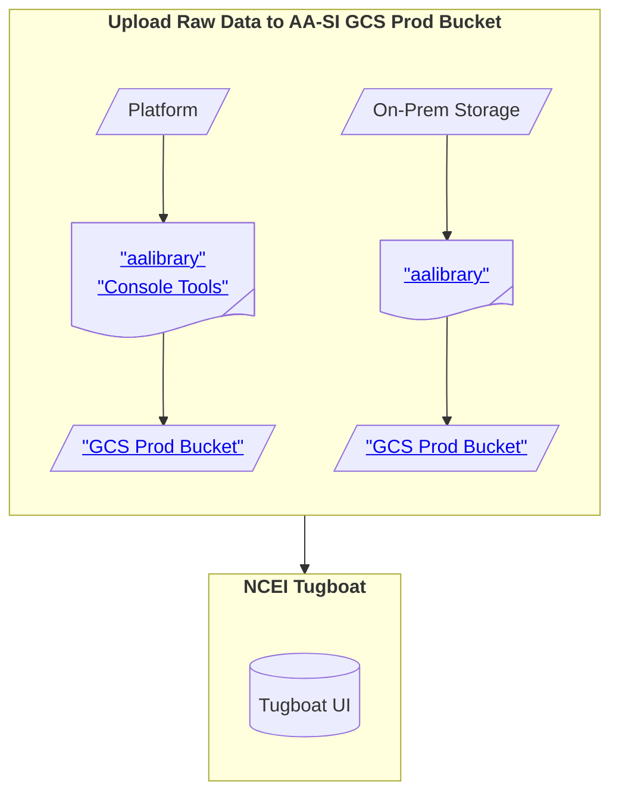
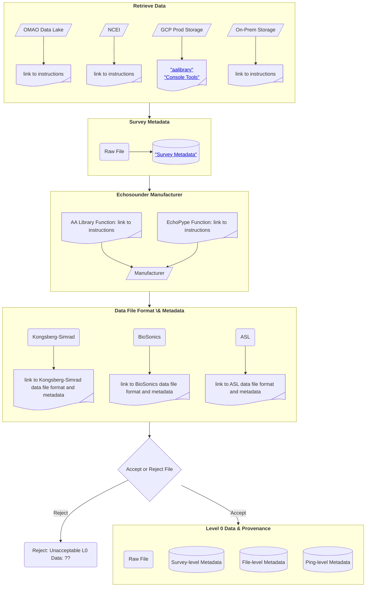
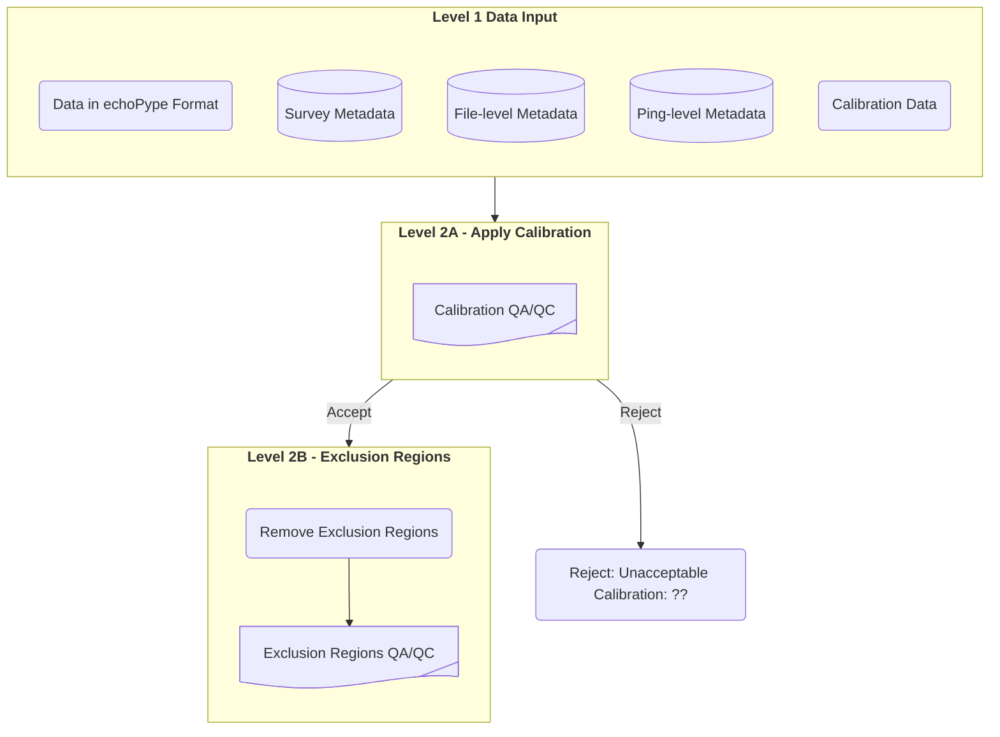

# AA-SI Data Road Map
The AA-SI is developing a data pipeline to store, process, and analyze data, and generate products for fisheries management. By necessity, this pipeline will be in the AA-SI's storage and computing environment  with GCP. One of the goals of this pipeline is to automate as much as we can so that we can effectively and efficiently address the growing data volume that we record and store.  

Our data road map is based on echoPype's data processing levels <a href="https://echolevels.readthedocs.io/en/latest/levels_proposed.html"> "echoPype processing levels"</a>, where each level represents a step from "raw" data in manufacturer-specified file formats to gridded data that are ready for input to advanced analytical models, such as, machine learning (ML), artificial intelligence (AI), Bayesian inverse (APES), and other advanced statistical models. Active-acoustic data (e.g., echosounder, SONAR, multibeam) are our primary data set, but we include supplemental data, such as oceanographic, biological, and geological data that characterize the environment, as well as metadata for all data streams.

For active acoustic data, we define the levels and processes within those levels as:  
- **Level -1**
    - **Input:** raw data from the acquisition platform in manufacturer-specified format
    - **Processes:**
      - Upload data from the platform to the <a href="https://console.cloud.google.com/storage/browser/ggn-nmfs-aa-prod-1-data;tab=objects?hl=en&inv=1&invt=Ab4KlQ&project=ggn-nmfs-aa-prod-1&pageState=(%22StorageObjectListTable%22:(%22f%22:%22%255B%255D%22))&prefix=&forceOnObjectsSortingFiltering=false"> "AA-SI GCS bucket" </a>
    - **Output:**
      - raw data files in the <a href="https://console.cloud.google.com/storage/browser/ggn-nmfs-aa-prod-1-data;tab=objects?hl=en&inv=1&invt=Ab4KlQ&project=ggn-nmfs-aa-prod-1&pageState=(%22StorageObjectListTable%22:(%22f%22:%22%255B%255D%22))&prefix=&forceOnObjectsSortingFiltering=false"> "AA-SI GCS bucket" </a>
- **Level 0**  
    - **Input:** raw data file in manufacturer-specified format located in the cloud or on-premise
    - **Processes:** 
      - Retrieve data from source (e.g., NCEI, GCP, on-prem, OMAO), 
      - Harvest survey-level metadata (who, what, when, where, why, and how) for the selected data,
      - Determine the echosounder manufacturer,
      - Determine the acquistion hardware and software used to record the data,
      - Harvest file-level metadata (e.g., number of channels, ...).
      - Harvest ping-level metadata (e.g., CW or FM, active or passive, ...)
    - **Output:** 
      - survey-level metadata
      - file-level metadata
      - ping-level metadata
- **Level 1**
    - **Input:** Data from Level 0
      - raw data file
      - survey-level metadata
      - file-level metadata
      - ping-level metadata
    - **Level 1A**
      - **Processes**:
        - Determine whether sufficient GPS data are recorded in the raw data file,
        - Harvest supplemental data recorded within the level 0 raw data file,
          - motion data
          - GPS
          - sound speed
          - attenuation
          - transducer depth
    - **Level 1B**
      - **Processes**:
        - Apply quality assurance (QA)/quality control (QC) criteria,
          - Merge supplemental data if needed (e.g., GPS),
          - Apply time-coordinate corrections,
          - Apply motion correction,
          - Other QA/QC?
        - Reformat manufacturer-specified-format active-acoustic data to "Echopype" and/or <a href="https://htmlpreview.github.io/?https://github.com/ices-publications/SONAR-netCDF4/blob/master/Formatted_docs/crr341.html"> "ICES SONAR-netCDF4"</a> open formats,
    - **Output:** Data files in open-source formats
      - The default is Echopype format, which we use as input to L2 and higher. 
      - Strict sonarNET-CDF4 format for coordination with other national and international groups.
      - Supplemental data and metadata to be used for processing the active-acoustic data. 
- **Level 2** 
    - **Input:** 
      - Level 1B data - files in Echopype format (volume and point-backscatter in (<a href="https://docs.xarray.dev/en/stable/"> "Xarray"</a>) format), 
      - Supplemental data and metadata 
      - Calibration data and metadata 
    - **Level 2A** 
      - **Processes:** 
        - Apply validated calibration data, 
    - **Level 2B** 
      - **Processes:** 
        - Apply noise-reduction (impulse, transient, background noise) algorithms, 
        - Apply noise-reduction lines and regions - e.g., bubble exclusion, seabed echo exclusion, instrument exclusion (e.g., CTD echo), 
    - **Output:** 
      - Calibration-verified, noise-reduced active-acoustic data in echoPype (<a href="https://docs.xarray.dev/en/stable/"> "Xarray"</a>) format) at native resolution 
- **Level 3** 
  - **Input:** 
    - Level 2B data: calibrated, noise-reduced data
  - **Level 3A** 
    - **Processes:** 
      - Grid the data at the selected spatial and/or temporal grid resolution, 
      - Provide validated data at the equivalent grid resolution, 
  - **Level 3B** 
    - **Processes:** 
      - Apply QA/QC criteria  
  - **Output:** 
    - Data ready for ingest to advanced AI/ML and analytical models 
- **Level 4**
    - TBD - AI/ML models

## Level -1 Data

```mermaid
---
config:
    flowchart:
        subGraphTitleMargin:
            "bottom": 30
---
flowchart TB
    subgraph SG_L-1_DataSource["<b>Upload Raw Data to AA-SI GCS Prod Bucket</b>"]
        direction TB
        node_L-1_SrcP@{shape: lean-r, label: "Platform"} --> node_L-1_AA1@{ shape: tag-doc, label: <a href="https://nmfs-ost.github.io/AA-SI_aalibrary/documentation/aalibrary" target="_blank"> "aalibrary"</a><br> <a href="https://github.com/nmfs-ost/AA-SI_ConsoleTools" target="_blank"> "Console Tools" </a> } --> node_L-1_GCS1@{shape: lean-r, label: <a href="https://console.cloud.google.com/storage/browser/ggn-nmfs-aa-prod-1-data;tab=objects?hl=en&inv=1&invt=Ab4KlQ&project=ggn-nmfs-aa-prod-1&pageState=(%22StorageObjectListTable%22:(%22f%22:%22%255B%255D%22))&prefix=&forceOnObjectsSortingFiltering=false" target="_blank"> "GCS Prod Bucket" </a> }
        node_L-1_SrcOP@{shape: lean-r, label: "On-Prem Storage"} --> node_L-1_AA2@{ shape: tag-doc, label: <a href="https://nmfs-ost.github.io/AA-SI_aalibrary/documentation/aalibrary" target="_blank"> "aalibrary"</a> } --> node_L-1_GCS2@{shape: lean-r, label: <a href="https://console.cloud.google.com/storage/browser/ggn-nmfs-aa-prod-1-data;tab=objects?hl=en&inv=1&invt=Ab4KlQ&project=ggn-nmfs-aa-prod-1&pageState=(%22StorageObjectListTable%22:(%22f%22:%22%255B%255D%22))&prefix=&forceOnObjectsSortingFiltering=false" target="_blank"> "GCS Prod Bucket" </a> }
        %%style node_SrcOMAO color:blue
    end
    subgraph SG_L-1_Tugboat["<b>NCEI Tugboat</b>"]
        direction TB
        node_L-1_TB@{shape: database, label: 'Tugboat UI' }
    end
    SG_L-1_DataSource --> SG_L-1_Tugboat
```
## Level 0 Data

```mermaid
---
config:
    flowchart:
        subGraphTitleMargin:
            "bottom": 30
---
flowchart TB
    subgraph SG_L0_DataSource["<b>Retrieve Data</b>"]
        direction TB
        node_L0_SrcOMAO@{shape: lean-r, label: "OMAO Data Lake"} --> node_L0_OMAO@{ shape: tag-doc, label: "link to instructions" }
        node_L0_SrcNCEI@{shape: lean-r, label: "NCEI"} --> node_L0_NCEI@{ shape: tag-doc, label: "link to instructions" }
        node_L0_SrcGCP@{shape: lean-r, label: "GCP Prod Storage"} --> node_L0_GCP@{ shape: tag-doc, label: <a href="https://nmfs-ost.github.io/AA-SI_aalibrary/documentation/aalibrary" target="_blank"> "aalibrary"</a><br> <a href="https://github.com/nmfs-ost/AA-SI_ConsoleTools" target="_blank"> "Console Tools" </a> }
        node_L0_SrcOP@{shape: lean-r, label: "On-Prem Storage"} --> node_L0_OP@{ shape: tag-doc, label: "link to instructions" }
        %%style node_SrcOMAO color:blue
    end
    subgraph SG_L0_SurveyMetaData["<b>Survey Metadata</b>"]
        direction LR
        node_L0_RF@{ shape: rounded, label: "Raw File" } --> node_L0_SMD@{ shape: database, label: <a href="https://console.cloud.google.com/bigquery?referrer=search&hl=en&invt=AbuwBQ&project=ggn-nmfs-aa-prod-1&rapt=AEjHL4OlTXzJnY9sYCgfXyE2O-JiDhka0a7L5x-wbqt9b1oGX4FYsSypa0yHTreTWIObb16IvbSrulruSRbU7J1RMJ_6Aw5owoIpWqU-wEbjaa8NZEvOt7A&ws=!1m6!1m5!4m3!1sggn-nmfs-aa-prod-1!2smetadata!3saalibrary_survey!23sTREE_NODE_SELECTION" target="_blank"> "Survey Metadata" </a> }
    end
    subgraph SG_L0_ESManufacturer["<b>Echosounder Manufacturer</b>"]
        direction TB
        node_L0_AL1@{shape: tag-doc, label: "AA Library Function: link to instructions"} --> node_L0_Man@{ shape: lean-r, label: "Manufacturer" }
        node_L0_AL2@{shape: tag-doc, label: "EchoPype Function: link to instructions"} --> node_L0_Man
    end
    subgraph SG_L0_ESMetaData["<b>Data File Format \& Metadata</b>"]
        direction TB
        node_L0_KS@{ shape: rounded, label: "Kongsberg-Simrad" } --> node_L0_KSMD@{ shape: tag-doc, label: "link to Kongsberg-Simrad data file format and metadata" }
        node_L0_BS@{ shape: rounded, label: "BioSonics" } --> node_L0_BSMD@{ shape: tag-doc, label: "link to BioSonics data file format and metadata" }
        node_L0_ASL@{ shape: rounded, label: "ASL" } --> node_L0_ASLMD@{ shape: tag-doc, label: "link to ASL data file format and metadata" }
    end
    subgraph SG_L0_Data["<b>Level 0 Data & Provenance</b>"]
        direction TB
        node_L0_RD@{ shape: rounded, label: "Raw File" }
        node_L0_SLMD@{ shape: database, label: "Survey-level Metadata" }
        node_L0_FLMD@{ shape: database, label: "File-level Metadata" }
        node_L0_PLMD@{ shape: database, label: "Ping-level Metadata" }
    end
    SG_L0_DataSource --> SG_L0_SurveyMetaData
    SG_L0_SurveyMetaData --> SG_L0_ESManufacturer
    SG_L0_ESManufacturer --> SG_L0_ESMetaData
    SG_L0_ESMetaData --> node_AcceptReject@{ shape: diamond, label: "Accept or Reject File" }
    node_AcceptReject --> |Accept| SG_L0_Data
    node_AcceptReject --> |Reject| node_Reject_L0@{ shape: rounded, label: "Reject: Unacceptable L0 Data: ??" }
```

Level 0 data are survey-level, file-level, and ping-level metadata (<b>data provenance</b>) and the raw data files.

## Level 1 Data

```mermaid
---
config:
    flowchart:
        subGraphTitleMargin:
            "bottom": 30
---
flowchart TB
    subgraph SG_L1_InputData["<b>Level 0 Data Input</b>"]
        direction TB
        node_L1_RD@{ shape: rounded, label: "Raw File" }
        node_L1_SMD@{ shape: database, label: "Survey Metadata" }
        node_L1_FMD@{ shape: database, label: "File-level Metadata" }
        node_L1_PMD@{ shape: database, label: "Ping-level Metadata" }
    end
    subgraph SG_L1A_GPS["<b>Level 1A - GPS</b>"]
        direction TB
        node_L1A_GPS@{ shape: tag-doc, label: "GPS QA/QC" }
    end
    subgraph SG_L1A_MD["<b>Level 1A - Supplemental Metadata</b>"]
        direction TB
        node_L1A_MD@{ shape: rounded, label: "Harvest Supplemental Metadata" } 
    end
    subgraph SG_L1B_MergeGPS["<b>Level 1B - Merge GPS</b>"]
        direction TB
        node_L1B_MergeGPS@{ shape: rounded, label: "Merge GPS Data" } 
    end
    subgraph SG_L1B_TimeCorr["<b>Level 1B - Time Coordinate Correction</b>"]
        direction TB
        node_L1B_TimeCorr@{ shape: rounded, label: "Apply Time Coordinate Correction" } 
    end
    subgraph SG_L1B_Motion["<b>Level 1B - Motion Correction</b>"]
        direction TB
        node_L1B_Motion@{ shape: rounded, label: "Apply Motion Correction" } 
    end
    subgraph SG_L1B_OS["<b>Open-Source File Format</b>"]
        direction LR
        node_L1B_EP@{ shape: rounded, label: "echoPype Format"}
        node_L1B_sonarNet@{ shape: rounded, label: "sonarNET-CDF4 Format"}
        node_L1B_suppdata@{ shape: rounded, label: "Supplemental Data"}
        node_L1B_SMD@{ shape: database, label: "Survey Metadata" }
        node_L1B_FMD@{ shape: database, label: "File-level Metadata" }
        node_L1B_PMD@{ shape: database, label: "Ping-level Metadata" }
    end
SG_L1_InputData --> SG_L1A_GPS
SG_L1A_GPS --> |Accept| SG_L1A_MD
SG_L1A_GPS --> |Reject| node_Reject_L1A_GPS@{ shape: rounded, label: "Reject: Unacceptable GPS: ??" }
SG_L1A_MD --> SG_L1B_MergeGPS
SG_L1B_MergeGPS --> SG_L1B_TimeCorr
SG_L1B_TimeCorr --> SG_L1B_Motion
SG_L1B_Motion --> |Accept| SG_L1B_OS
SG_L1B_Motion --> |Reject| node_Reject_L1B@{ shape: rounded, label: "Reject: Unacceptable Data Format: ??" }


```
Level 1 data are the Echopype netCDF4 data file, supplemental data files, and metadata (<b>data provenance</b>).  

## Level 2 Data

```mermaid
---
config:
    flowchart:
        subGraphTitleMargin:
            "bottom": 30
---
flowchart TB
    subgraph SG_L2_InputData["<b>Level 1 Data Input</b>"]
        direction TB
        node_L2_RD@{ shape: rounded, label: "Data in echoPype Format" }
        node_L2_SMD@{ shape: database, label: "Survey Metadata" }
        node_L2_FMD@{ shape: database, label: "File-level Metadata" }
        node_L2_PMD@{ shape: database, label: "Ping-level Metadata" }
        node_L2_Cal@{ shape: rounded, label: "Calibration Data" }
    end
    subgraph SG_L2A_Cal["<b>Level 2A - Apply Calibration</b>"]
        direction TB
        node_L2A_Cal@{ shape: tag-doc, label: "Calibration QA/QC" }
    end
    subgraph SG_L2B_Exclusion["<b>Level 2B - Exclusion Regions</b>"]
        direction TB
        node_L2B_Exclusion@{ shape: rounded, label: "Remove Exclusion Regions" } --> node_L2B_ExOK@{ shape: tag-doc, label: "Exclusion Regions QA/QC" }
    end

SG_L2_InputData --> SG_L2A_Cal
SG_L2A_Cal --> |Accept| SG_L2B_Exclusion
SG_L2A_Cal --> |Reject| node_Reject_L2A@{ shape: rounded, label: "Reject: Unacceptable Calibration: ??" }

```
Level 2 data are calibrated data in Echopype netCDF4 format, supplemental data files, and metadata.  

## Level 3 Data

```mermaid
---
config:
    flowchart:
        subGraphTitleMargin:
            "bottom": 30
---
flowchart TB
    subgraph SG_L3_InputData["<b>Level 2 Data Input</b>"]
        direction TB
        node_L3_RD@{ shape: rounded, label: "Calibrated, noise reduced echoPype Data" }
        node_L3_SMD@{ shape: database, label: "Survey Metadata" }
        node_L3_FMD@{ shape: database, label: "File-level Metadata" }
        node_L3_PMD@{ shape: database, label: "Ping-level Metadata" }
    end
    subgraph SG_L3A_Grid["<b>Level 3A - Apply Gridding</b>"]
        direction TB
        node_L3A_Grid@{ shape: tag-doc, label: "Apply Spatiotemporal Grid" }
    end
    subgraph SG_L3A_ValData["<b>Level 3A - Grid Validated Data</b>"]
        direction TB
        node_L3A_ValData@{ shape: tag-doc, label: "Grid Validated Data" }
    end
    subgraph SG_L3B_QAQC["<b>Level 3B - Apply Final QA/QC Criteria</b>"]
        direction TB
        node_L3B_QAQC@{ shape: rounded, label: "Apply Final QA/QC" }
    end
    subgraph SG_L3B_Output["<b>Level 3B Output</b>"]
        direction TB
        node_L3B_RD@{ shape: rounded, label: "Gridded, calibrated, noise reduced echoPype Data" }
        node_L3B_SMD@{ shape: database, label: "Survey Metadata" }
        node_L3B_FMD@{ shape: database, label: "File-level Metadata" }
        node_L3B_PMD@{ shape: database, label: "Ping-level Metadata" }
    end
SG_L3_InputData --> SG_L3A_Grid
SG_L3A_Grid --> |Accept| SG_L3A_ValData
SG_L3A_Grid --> |Reject| node_Reject_L3A@{ shape: rounded, label: "Reject: Unacceptable Grid: ??" }
SG_L3A_ValData --> SG_L3B_QAQC
SG_L3B_QAQC --> |Accept| SG_L3B_Output
SG_L3B_QAQC --> |Reject| node_Reject_L3B@{ shape: rounded, label: "Reject: Unacceptable Data: ??" }

```
Level 3 data are ready for ingest to advanced AI/ML and analytical models

