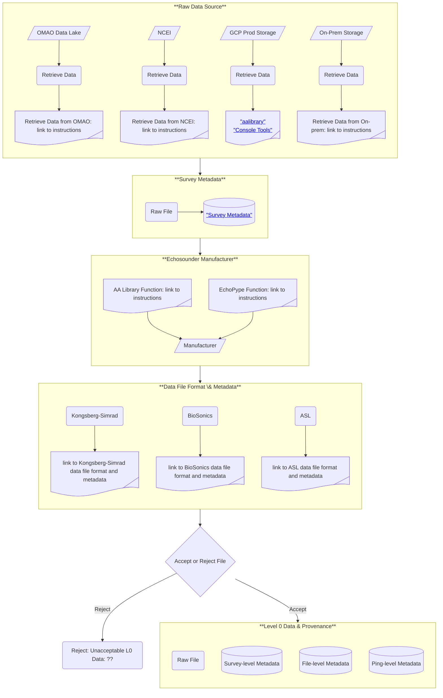
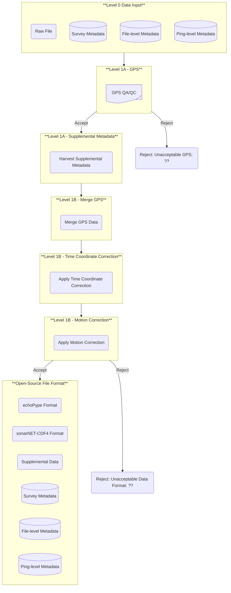
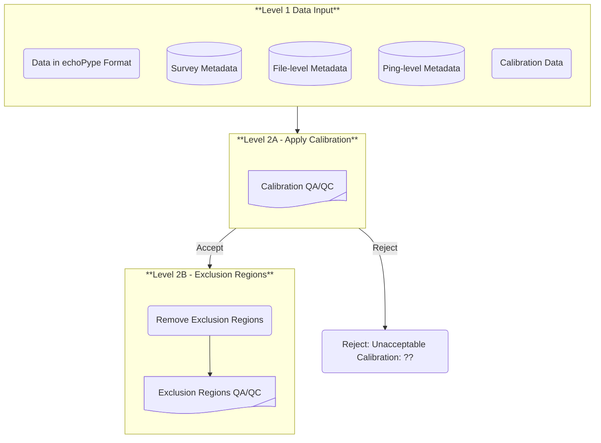
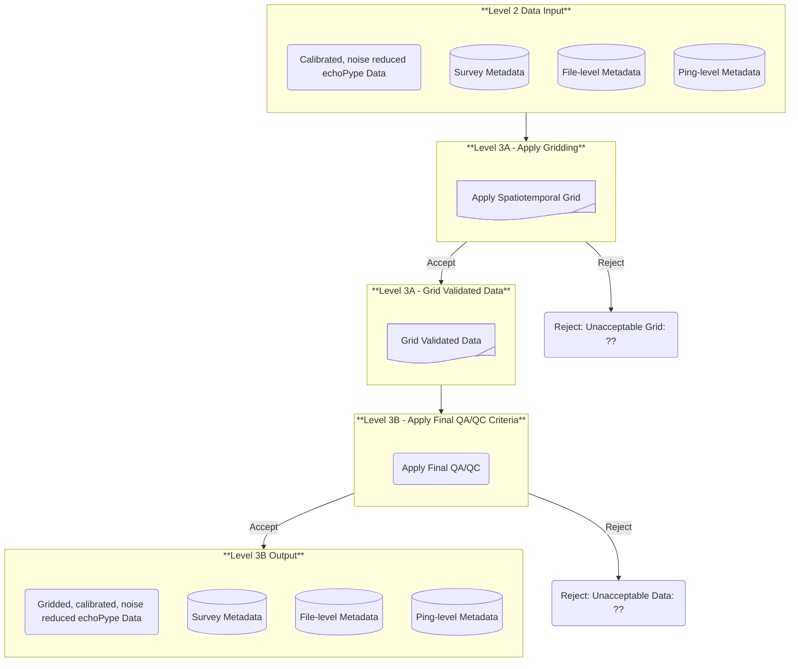

# AA-SI Data Road Map
The AA-SI is developing a data pipeline to store, process, and analyze data, and generate products for fisheries management. By necessity, this pipeline will be in the AA-SI's storage and computing environment  with GCP. One of the goals of this pipeline is to automate as much as we can so that we can effectively and efficiently address the growing data volume that we record and store.  

Our data road map is based on echoPype's data processing levels <a href="https://echolevels.readthedocs.io/en/latest/levels_proposed.html"> "echoPype processing levels"</a>, where each level represents a step from "raw" data in manufacturer-specified file formats to gridded data that are ready for input to advanced analytical models, such as, machine learning (ML), artificial intelligence (AI), Bayesian inverse (APES), and other advanced statistical models. Active-acoustic data (e.g., echosounder, SONAR, multibeam) are our primary data set, but we include supplemental data, such as oceanographic, biological, and geological data that characterize the environment, as well as metadata for all data streams.

For active acoustic data, we define the levels and processes within those levels as:  
- **Level 0**  
    - **Input:** raw data file in manufacturer-specified format located in the cloud or on-premise
    - **Processes:** 
      - Retrieve data from source (e.g., NCEI, GCP, on-prem, OMAO), 
      - Harvest survey-level metadata (who, what, when, where, why, and how) for the selected data,
      - Determine the echosounder manufacturer,
      - Determine the acquistion hardware and software used to record the data,
      - Harvest file-level metadata (e.g., number of channels, ...).
      - Harvest ping-level metadata (e.g., CW or FM, active or passive, ...)
    - **Output:** 
      - survey-level metadata
      - file-level metadata
      - ping-level metadata
- **Level 1**
    - **Input:** Data from Level 0
      - raw data file
      - survey-level metadata
      - file-level metadata
      - ping-level metadata
    - **Level 1A**
      - **Processes**:
        - Determine whether sufficient GPS data are recorded in the raw data file,
        - Harvest supplemental data recorded within the level 0 raw data file,
          - motion data
          - GPS
          - sound speed
          - attenuation
          - transducer depth
    - **Level 1B**
      - **Processes**:
        - Apply quality assurance (QA)/quality control (QC) criteria,
          - Merge supplemental data if needed (e.g., GPS),
          - Apply time-coordinate corrections,
          - Apply motion correction,
          - Other QA/QC?
        - Reformat manufacturer-specified-format active-acoustic data to "Echopype" and/or <a href="https://htmlpreview.github.io/?https://github.com/ices-publications/SONAR-netCDF4/blob/master/Formatted_docs/crr341.html"> "ICES SONAR-netCDF4"</a> open formats,
    - **Output:** Data files in open-source formats
      - The default is Echopype format, which we use as input to L2 and higher. 
      - Strict sonarNET-CDF4 format for coordination with other national and international groups.
      - Supplemental data and metadata to be used for processing the active-acoustic data. 
- **Level 2** 
    - **Input:** 
      - Level 1B data - files in Echopype format (volume and point-backscatter in (<a href="https://docs.xarray.dev/en/stable/"> "Xarray"</a>) format), 
      - Supplemental data and metadata 
      - Calibration data and metadata 
    - **Level 2A** 
      - **Processes:** 
        - Apply validated calibration data, 
    - **Level 2B** 
      - **Processes:** 
        - Apply noise-reduction (impulse, transient, background noise) algorithms, 
        - Apply noise-reduction lines and regions - e.g., bubble exclusion, seabed echo exclusion, instrument exclusion (e.g., CTD echo), 
    - **Output:** 
      - Calibration-verified, noise-reduced active-acoustic data in echoPype (<a href="https://docs.xarray.dev/en/stable/"> "Xarray"</a>) format) at native resolution 
- **Level 3** 
  - **Input:** 
    - Level 2B data: calibrated, noise-reduced data
  - **Level 3A** 
    - **Processes:** 
      - Grid the data at the selected spatial and/or temporal grid resolution, 
      - Provide validated data at the equivalent grid resolution, 
  - **Level 3B** 
    - **Processes:** 
      - Apply QA/QC criteria  
  - **Output:** 
    - Data ready for ingest to advanced AI/ML and analytical models 
- **Level 4**
    - TBD - AI/ML models

## Level 0 Data

```mermaid
---
config:
    flowchart:
        subGraphTitleMargin:
            "bottom": 30
---
flowchart TB
    subgraph SG_L0_DataSource["**Raw Data Source**"]
        direction TB
        node_L0_SrcOMAO@{shape: lean-r, label: "OMAO Data Lake"} --> node_L0_RDOMAO@{ shape: rounded, label: "Retrieve Data" } --> node_L0_OMAO@{ shape: tag-doc, label: "Retrieve Data from OMAO: link to instructions" }
        node_L0_SrcNCEI@{shape: lean-r, label: "NCEI"} --> node_L0_RDNCEI@{ shape: rounded, label: "Retrieve Data" } --> node_L0_NCEI@{ shape: tag-doc, label: "Retrieve Data from NCEI: link to instructions" }
        node_L0_SrcGCP@{shape: lean-r, label: "GCP Prod Storage"} --> node_L0_RDGCP@{ shape: rounded, label: "Retrieve Data" } --> node_L0_GCP@{ shape: tag-doc, label: <a href="https://nmfs-ost.github.io/AA-SI_aalibrary/documentation/aalibrary" target="_blank"> "aalibrary"</a><br> <a href="https://github.com/nmfs-ost/AA-SI_ConsoleTools" target="_blank"> "Console Tools" </a> }
        node_L0_SrcOP@{shape: lean-r, label: "On-Prem Storage"} --> node_L0_RDOP@{ shape: rounded, label: "Retrieve Data" } --> node_L0_OP@{ shape: tag-doc, label: "Retrieve Data from On-prem: link to instructions" }
        %%style node_SrcOMAO color:blue
    end
    subgraph SG_L0_SurveyMetaData["**Survey Metadata**"]
        direction LR
        node_L0_RF@{ shape: rounded, label: "Raw File" } --> node_L0_SMD@{ shape: database, label: <a href="https://console.cloud.google.com/bigquery?referrer=search&hl=en&invt=AbuwBQ&project=ggn-nmfs-aa-prod-1&rapt=AEjHL4OlTXzJnY9sYCgfXyE2O-JiDhka0a7L5x-wbqt9b1oGX4FYsSypa0yHTreTWIObb16IvbSrulruSRbU7J1RMJ_6Aw5owoIpWqU-wEbjaa8NZEvOt7A"> "Survey Metadata" </a> }
    end
    subgraph SG_L0_ESManufacturer["**Echosounder Manufacturer**"]
        direction TB
        node_L0_AL1@{shape: tag-doc, label: "AA Library Function: link to instructions"} --> node_L0_Man@{ shape: lean-r, label: "Manufacturer" }
        node_L0_AL2@{shape: tag-doc, label: "EchoPype Function: link to instructions"} --> node_L0_Man
    end
    subgraph SG_L0_ESMetaData["**Data File Format \& Metadata**"]
        direction TB
        node_L0_KS@{ shape: rounded, label: "Kongsberg-Simrad" } --> node_L0_KSMD@{ shape: tag-doc, label: "link to Kongsberg-Simrad data file format and metadata" }
        node_L0_BS@{ shape: rounded, label: "BioSonics" } --> node_L0_BSMD@{ shape: tag-doc, label: "link to BioSonics data file format and metadata" }
        node_L0_ASL@{ shape: rounded, label: "ASL" } --> node_L0_ASLMD@{ shape: tag-doc, label: "link to ASL data file format and metadata" }
    end
    subgraph SG_L0_Data["**Level 0 Data & Provenance**"]
        direction TB
        node_L0_RD@{ shape: rounded, label: "Raw File" }
        node_L0_SLMD@{ shape: database, label: "Survey-level Metadata" }
        node_L0_FLMD@{ shape: database, label: "File-level Metadata" }
        node_L0_PLMD@{ shape: database, label: "Ping-level Metadata" }
    end
    SG_L0_DataSource --> SG_L0_SurveyMetaData
    SG_L0_SurveyMetaData --> SG_L0_ESManufacturer
    SG_L0_ESManufacturer --> SG_L0_ESMetaData
    SG_L0_ESMetaData --> node_AcceptReject@{ shape: diamond, label: "Accept or Reject File" }
    node_AcceptReject --> |Accept| SG_L0_Data
    node_AcceptReject --> |Reject| node_Reject_L0@{ shape: rounded, label: "Reject: Unacceptable L0 Data: ??" }
```

Level 0 data are survey-level, file-level, and ping-level metadata (**data provenance**) and the raw data files.

## Level 1 Data

```mermaid
---
config:
    flowchart:
        subGraphTitleMargin:
            "bottom": 30
---
flowchart TB
    subgraph SG_L1_InputData["**Level 0 Data Input**"]
        direction TB
        node_L1_RD@{ shape: rounded, label: "Raw File" }
        node_L1_SMD@{ shape: database, label: "Survey Metadata" }
        node_L1_FMD@{ shape: database, label: "File-level Metadata" }
        node_L1_PMD@{ shape: database, label: "Ping-level Metadata" }
    end
    subgraph SG_L1A_GPS["**Level 1A - GPS**"]
        direction TB
        node_L1A_GPS@{ shape: tag-doc, label: "GPS QA/QC" }
    end
    subgraph SG_L1A_MD["**Level 1A - Supplemental Metadata**"]
        direction TB
        node_L1A_MD@{ shape: rounded, label: "Harvest Supplemental Metadata" } 
    end
    subgraph SG_L1B_MergeGPS["**Level 1B - Merge GPS**"]
        direction TB
        node_L1B_MergeGPS@{ shape: rounded, label: "Merge GPS Data" } 
    end
    subgraph SG_L1B_TimeCorr["**Level 1B - Time Coordinate Correction**"]
        direction TB
        node_L1B_TimeCorr@{ shape: rounded, label: "Apply Time Coordinate Correction" } 
    end
    subgraph SG_L1B_Motion["**Level 1B - Motion Correction**"]
        direction TB
        node_L1B_Motion@{ shape: rounded, label: "Apply Motion Correction" } 
    end
    subgraph SG_L1B_OS["**Open-Source File Format**"]
        direction LR
        node_L1B_EP@{ shape: rounded, label: "echoPype Format"}
        node_L1B_sonarNet@{ shape: rounded, label: "sonarNET-CDF4 Format"}
        node_L1B_suppdata@{ shape: rounded, label: "Supplemental Data"}
        node_L1B_SMD@{ shape: database, label: "Survey Metadata" }
        node_L1B_FMD@{ shape: database, label: "File-level Metadata" }
        node_L1B_PMD@{ shape: database, label: "Ping-level Metadata" }
    end
SG_L1_InputData --> SG_L1A_GPS
SG_L1A_GPS --> |Accept| SG_L1A_MD
SG_L1A_GPS --> |Reject| node_Reject_L1A_GPS@{ shape: rounded, label: "Reject: Unacceptable GPS: ??" }
SG_L1A_MD --> SG_L1B_MergeGPS
SG_L1B_MergeGPS --> SG_L1B_TimeCorr
SG_L1B_TimeCorr --> SG_L1B_Motion
SG_L1B_Motion --> |Accept| SG_L1B_OS
SG_L1B_Motion --> |Reject| node_Reject_L1B@{ shape: rounded, label: "Reject: Unacceptable Data Format: ??" }


```
Level 1 data are the Echopype netCDF4 data file, supplemental data files, and metadata (**data provenance**).  

## Level 2 Data

```mermaid
---
config:
    flowchart:
        subGraphTitleMargin:
            "bottom": 30
---
flowchart TB
    subgraph SG_L2_InputData["**Level 1 Data Input**"]
        direction TB
        node_L2_RD@{ shape: rounded, label: "Data in echoPype Format" }
        node_L2_SMD@{ shape: database, label: "Survey Metadata" }
        node_L2_FMD@{ shape: database, label: "File-level Metadata" }
        node_L2_PMD@{ shape: database, label: "Ping-level Metadata" }
        node_L2_Cal@{ shape: rounded, label: "Calibration Data" }
    end
    subgraph SG_L2A_Cal["**Level 2A - Apply Calibration**"]
        direction TB
        node_L2A_Cal@{ shape: tag-doc, label: "Calibration QA/QC" }
    end
    subgraph SG_L2B_Exclusion["**Level 2B - Exclusion Regions**"]
        direction TB
        node_L2B_Exclusion@{ shape: rounded, label: "Remove Exclusion Regions" } --> node_L2B_ExOK@{ shape: tag-doc, label: "Exclusion Regions QA/QC" }
    end

SG_L2_InputData --> SG_L2A_Cal
SG_L2A_Cal --> |Accept| SG_L2B_Exclusion
SG_L2A_Cal --> |Reject| node_Reject_L2A@{ shape: rounded, label: "Reject: Unacceptable Calibration: ??" }

```
Level 2 data are calibrated data in Echopype netCDF4 format, supplemental data files, and metadata.  

## Level 3 Data

```mermaid
---
config:
    flowchart:
        subGraphTitleMargin:
            "bottom": 30
---
flowchart TB
    subgraph SG_L3_InputData["**Level 2 Data Input**"]
        direction TB
        node_L3_RD@{ shape: rounded, label: "Calibrated, noise reduced echoPype Data" }
        node_L3_SMD@{ shape: database, label: "Survey Metadata" }
        node_L3_FMD@{ shape: database, label: "File-level Metadata" }
        node_L3_PMD@{ shape: database, label: "Ping-level Metadata" }
    end
    subgraph SG_L3A_Grid["**Level 3A - Apply Gridding**"]
        direction TB
        node_L3A_Grid@{ shape: tag-doc, label: "Apply Spatiotemporal Grid" }
    end
    subgraph SG_L3A_ValData["**Level 3A - Grid Validated Data**"]
        direction TB
        node_L3A_ValData@{ shape: tag-doc, label: "Grid Validated Data" }
    end
    subgraph SG_L3B_QAQC["**Level 3B - Apply Final QA/QC Criteria**"]
        direction TB
        node_L3B_QAQC@{ shape: rounded, label: "Apply Final QA/QC" }
    end
    subgraph SG_L3B_Output["**Level 3B Output**"]
        direction TB
        node_L3B_RD@{ shape: rounded, label: "Gridded, calibrated, noise reduced echoPype Data" }
        node_L3B_SMD@{ shape: database, label: "Survey Metadata" }
        node_L3B_FMD@{ shape: database, label: "File-level Metadata" }
        node_L3B_PMD@{ shape: database, label: "Ping-level Metadata" }
    end
SG_L3_InputData --> SG_L3A_Grid
SG_L3A_Grid --> |Accept| SG_L3A_ValData
SG_L3A_Grid --> |Reject| node_Reject_L3A@{ shape: rounded, label: "Reject: Unacceptable Grid: ??" }
SG_L3A_ValData --> SG_L3B_QAQC
SG_L3B_QAQC --> |Accept| SG_L3B_Output
SG_L3B_QAQC --> |Reject| node_Reject_L3B@{ shape: rounded, label: "Reject: Unacceptable Data: ??" }

```
Level 3 data are ready for ingest to advanced AI/ML and analytical models


# AA-SI Active-Acoustic Data Pipeline

A console-tool-based pipeline for processing active-acoustic data (echosounder,
SONAR, multibeam) from raw manufacturer files through to gridded, ML-ready
products. Each processing level transforms the data and writes a new NetCDF
file; the next stage reads it via path-based piping (`tool | tool | tool`).

> **Legend** — Tools marked with `*` are **suggested / theoretical**: they
> follow the established `aa-*` naming convention but have not been built yet.
> Unmarked tools exist in the current suite.

---

## Pipeline Overview


```mermaid
flowchart TD
    RAW[("Raw manufacturer files<br/>(EK60, EK80, AZFP, …)")]:::source

    subgraph L0["Level 0 — Retrieval & Metadata Harvest"]
        direction TB
        L0A["Retrieve raw data<br/><code>aa-find · aa-get · aa-fetch · aa-raw</code>"]:::exists
        L0B["Harvest survey metadata<br/><code>aa-meta-survey*</code>"]:::suggested
        L0C["Identify hardware / software<br/><code>aa-id-manufacturer* · aa-id-acquisition*</code>"]:::suggested
        L0D["Harvest file & ping metadata<br/><code>aa-meta-file* · aa-meta-ping*</code>"]:::suggested
        L0A --> L0B --> L0C --> L0D
    end

    DB[("Metadata DB<br/><code>aa-meta-push* · aa-meta-query*</code>")]:::db

    subgraph L1A["Level 1A — Supplemental Data"]
        direction TB
        L1A1["GPS sufficiency check<br/><code>aa-gps-check*</code>"]:::suggested
        L1A2["Harvest motion / GPS / SS / atten.<br/><code>aa-harvest-suppl*</code>"]:::suggested
        L1A1 --> L1A2
    end

    subgraph L1B["Level 1B — QA/QC & Open Format"]
        direction TB
        L1B1["Merge supplementals<br/><code>aa-location · aa-merge-suppl*</code>"]:::partial
        L1B2["Time-coordinate correction<br/><code>aa-coerce-time</code>"]:::exists
        L1B3["Motion correction<br/><code>aa-motion-correct*</code>"]:::suggested
        L1B4["Reformat → Echopype<br/><code>aa-nc</code>"]:::exists
        L1B5["Export → ICES SONAR-netCDF4<br/><code>aa-export-sonarnc4*</code>"]:::suggested
        L1B1 --> L1B2 --> L1B3 --> L1B4 --> L1B5
    end

    subgraph L2A["Level 2A — Calibration"]
        direction TB
        L2A1["Fetch validated cal<br/><code>aa-cal-fetch*</code>"]:::suggested
        L2A2["Apply calibration / compute Sv<br/><code>aa-sv · aa-ts · aa-calibrate*</code>"]:::partial
        L2A3["Split-beam angles · depth · freq<br/><code>aa-splitbeam-angle · aa-depth · aa-swap-freq</code>"]:::exists
        L2A1 --> L2A2 --> L2A3
    end

    subgraph L2B["Level 2B — Noise Reduction & Exclusion"]
        direction TB
        L2B1["Background / impulse / transient<br/><code>aa-clean · aa-noise-est · aa-impulse · aa-min · aa-transient · aa-detect-transient</code>"]:::exists
        L2B2["Attenuated · multi-freq · features<br/><code>aa-attenuated · aa-freqdiff · aa-detect-seafloor · aa-detect-shoal</code>"]:::exists
        L2B3["Bubble & instrument exclusion<br/><code>aa-bubble-mask* · aa-instrument-mask*</code>"]:::suggested
        L2B4["Manual lines / regions<br/><code>aa-evl · aa-evr</code>"]:::exists
        L2B1 --> L2B2 --> L2B3 --> L2B4
    end

    subgraph L3A["Level 3A — Gridding"]
        direction TB
        L3A1["MVBS gridding<br/><code>aa-mvbs · aa-mvbs-index</code>"]:::exists
        L3A2["NASC integration<br/><code>aa-nasc</code>"]:::exists
        L3A3["Grid validation<br/><code>aa-grid-validate*</code>"]:::suggested
        L3A1 --> L3A2 --> L3A3
    end

    subgraph L3B["Level 3B — QA/QC of Grids"]
        direction TB
        L3B1["Grid QA/QC<br/><code>aa-grid-qc*</code>"]:::suggested
        L3B2["Summary metrics<br/><code>aa-abundance · aa-aggregation · aa-center-of-mass · aa-dispersion · aa-evenness</code>"]:::exists
        L3B1 --> L3B2
    end

    subgraph L4["Level 4 — AI/ML Clustering"]
        direction TB
        L4_in["ML-ready gridded data"]:::ml
        L4_dbscan["<code>aa-dbscan*</code><br/>Density-based clustering"]:::suggested
        L4_kmeans["<code>aa-kmeans*</code><br/>k-Means clustering"]:::suggested
        L4_hdbscan["<code>aa-hdbscan*</code><br/>Hierarchical density clustering"]:::suggested
        L4_in --> L4_dbscan
        L4_in --> L4_kmeans
        L4_in --> L4_hdbscan
    end

    RAW --> L0
    L0  -. publishes .-> DB
    L0  --> L1A
    L1A --> L1B
    L1B --> L2A
    L2A --> L2B
    L2B --> L3A
    L3A --> L3B
    L3B --> L4

    classDef exists    fill:#d8f0de,stroke:#1f7a3a,stroke-width:1px,color:#0a3a18;
    classDef partial   fill:#fff4d4,stroke:#a96a00,stroke-width:1px,color:#4a2f00;
    classDef suggested fill:#fde0e0,stroke:#a32020,stroke-width:1px,stroke-dasharray:4 3,color:#4a0808;
    classDef source    fill:#e6ecf5,stroke:#1a3d6d,stroke-width:1px,color:#0e1f3a;
    classDef db        fill:#dfe7f5,stroke:#1a3d6d,stroke-width:1.5px,color:#0e1f3a;
    classDef ml        fill:#e8defa,stroke:#5b2a8c,stroke-width:1px,color:#2a1247;
```

**Status colors**

| Color | Meaning |
|---|---|
| 🟢 Green | Tool exists and covers the step |
| 🟡 Yellow | Tool exists but only partially covers the step |
| 🔴 Red (dashed) | Suggested / theoretical tool — not yet built |

---

## Level Descriptions

### Level 0 — Retrieval & Metadata Harvest

Pulls a raw file from its source (NCEI, GCP, on-prem, OMAO, Azure) and reads
every layer of metadata baked into the file: who recorded it, what hardware
recorded it, what configuration was running, and what each ping looks like.
Output is metadata records that get written to the metadata DB; the raw file
itself is staged for the next level.

**Tools:** `aa-find`, `aa-get`, `aa-fetch`, `aa-raw`, `aa-meta-survey*`,
`aa-id-manufacturer*`, `aa-id-acquisition*`, `aa-meta-file*`, `aa-meta-ping*`,
`aa-meta-push*`, `aa-meta-query*`

### Level 1A — Supplemental Data

Checks whether the raw file contains enough GPS to be useful, then harvests
the supplemental data streams embedded in the raw file (motion, navigation,
sound speed, attenuation). These streams are needed for the corrections
applied in 1B.

**Tools:** `aa-gps-check*`, `aa-harvest-suppl*`

### Level 1B — QA/QC & Open-Format Reformat

Applies the corrections that make the data trustworthy: merges in external
supplementals if needed, fixes time reversals, corrects for platform motion,
and finally rewrites the raw data into the open Echopype format (and
optionally the strict ICES SONAR-netCDF4 format for external coordination).
This is the boundary where manufacturer-specific formats stop and standard
formats begin.

**Tools:** `aa-location`, `aa-merge-suppl*`, `aa-coerce-time`,
`aa-motion-correct*`, `aa-nc`, `aa-export-sonarnc4*`

### Level 2A — Calibration

Pulls validated calibration records (gain, equivalent beam angle, sa
correction, etc.) and applies them while computing Sv (volume backscattering
strength) and TS (target strength). Also augments the dataset with split-beam
angles, depth axis, and a frequency-indexed view.

**Tools:** `aa-cal-fetch*`, `aa-calibrate*`, `aa-sv`, `aa-ts`,
`aa-splitbeam-angle`, `aa-depth`, `aa-swap-freq`

### Level 2B — Noise Reduction & Exclusion

Removes everything that isn't fish/biology of interest: background noise,
impulse noise, transient noise, attenuated pings, bubble sweep-down, hull and
CTD echoes, and the seabed echo. Manual exclusion lines and regions can also
be imported from Echoview (`.evl`, `.evr`).

**Tools:** `aa-clean`, `aa-noise-est`, `aa-impulse`, `aa-min`, `aa-transient`,
`aa-detect-transient`, `aa-attenuated`, `aa-freqdiff`, `aa-detect-seafloor`,
`aa-detect-shoal`, `aa-bubble-mask*`, `aa-instrument-mask*`, `aa-evl`,
`aa-evr`

### Level 3A — Gridding

Bins the cleaned, calibrated data onto a regular grid. MVBS (Mean Volume
Backscattering Strength) averages Sv in time × range cells; NASC (Nautical
Area Scattering Coefficient) integrates Sv over depth and distance for
biomass estimation. Grid coverage is validated against source extents.

**Tools:** `aa-mvbs`, `aa-mvbs-index`, `aa-nasc`, `aa-grid-validate*`

### Level 3B — QA/QC of Gridded Products

Checks the gridded output for coverage gaps, bin counts, NaN rates, and
outliers, and computes summary metrics that downstream models or analysts
can use as features or sanity checks.

**Tools:** `aa-grid-qc*`, `aa-abundance`, `aa-aggregation`,
`aa-center-of-mass`, `aa-dispersion`, `aa-evenness`

### Level 4 — AI/ML Clustering

Consumes the gridded, QA/QC'd output and runs unsupervised clustering to
group cells with similar acoustic signatures — useful for identifying
scattering layers, schools, or species-like assemblages without a labeled
training set.

| Tool | Algorithm | When to reach for it |
|---|---|---|
| `aa-dbscan*` | DBSCAN | Density-based clustering with no need to specify cluster count; flags low-density points as noise. Good first pass on cell features when cluster shape is irregular. |
| `aa-kmeans*` | k-Means | Fast partitioning into a fixed `k` clusters; assumes roughly spherical, evenly sized clusters. Good when a known number of acoustic classes is expected. |
| `aa-hdbscan*` | HDBSCAN | Hierarchical, density-based — handles varying cluster densities and a wider range of cluster shapes than DBSCAN. Best when cluster density varies across the survey. |

All three are suggested tools and would share the same interface conventions
as the rest of the suite: read a NetCDF path from stdin or argv, write a new
NetCDF with cluster labels, print the output path to stdout for the next
stage.

---

## Path-Based Piping Convention

Every tool in the suite reads a NetCDF path (positional arg or stdin), writes
a new NetCDF to disk, and prints the output path to stdout. This makes the
whole pipeline composable from the shell:

```bash
aa-nc raw.raw --sonar_model EK60 \
  | aa-sv \
  | aa-clean \
  | aa-mvbs \
  | aa-hdbscan
```

Each stage appends a suffix to the input filename
(`raw.nc → raw_Sv.nc → raw_Sv_clean.nc → …`), so intermediates are inspectable
and the pipeline is restart-able from any point.
