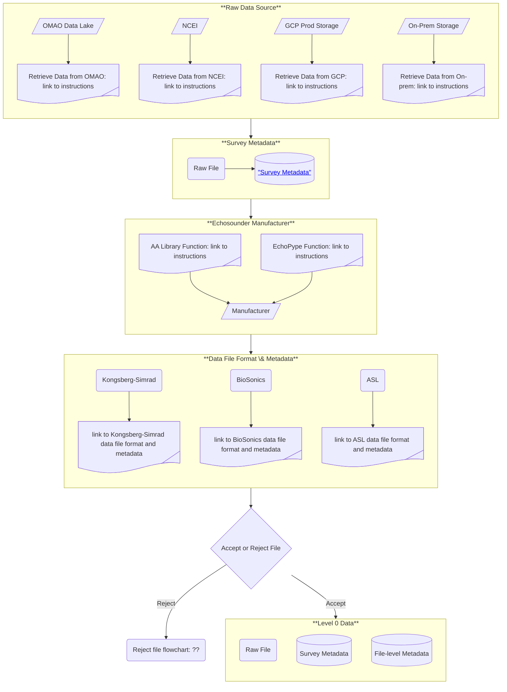

# AA-SI Data Road Map
The AA-SI is developing a data pipeline to store, process, and analyze data, and generate products for fisheries management. By necessity, this pipeline will be in the AA-SI's storage and computing environment  with GCP. One of the goals of this pipeline is to automate as much as we can so that we can effectively and efficiently address the growing data volume that we record and store.  

Our data road map is based on echoPype's data processing levels <a href="https://echolevels.readthedocs.io/en/latest/levels_proposed.html"> "echoPype processing levels"</a>, where each level represents a step from "raw" data in manufacturer-specified file formats to gridded data that are ready for input to advanced analytical models, such as, machine learning (ML), artificial intelligence (AI), Bayesian inverse (APES), and other advanced statistical models. Active-acoustic data (echosounder, SONAR, multibeam) are our primary data set, but we include supplemental data, such as oceanographic, biological, and geological data that characterize the environment, as well as metadata for all data streams.

For active acoustic data, we define the levels and processes within those levels as:  
- **Level 0**  
    - **Input**: raw data file in manufacturer-specified format located in the cloud or on-premise, 
        1\. Harvest survey-level metadata (who, what, when, where, why, and how) for the selected data, 
        2\. Determine the echosounder manufacturer - this is the first step towards determining the file format, 
        3\. Determine the acquistion hardware and software used to record the data - this determines the file format, 
        4\. Harvest file-level metadata (CW or FM mode, number of channels, ...) - this confirms that the file is readable. 
    - **Output**: survey-level and file-level metadata.
- **Level 1**
    - Input: Level 0 data - raw data file, survey-level, and file-level metadata,
    - Harvest all ancillary data (e.g., motion, GPS, sound speed, attenuation, ...) recorded within the level 0 raw data file,
    - Apply quality assurance (QA)/quality control (QC) criteria, e.g.,
        - Determine whether required supplemental data are missing (e.g., GPS)
        - Apply time-coordinate corrections
        - Check for missing data
    - Continue if the file passes QA/QC
    - Reformat manufacturer-specified-format active-acoustic data to "Echopype" or <a href="https://htmlpreview.github.io/?https://github.com/ices-publications/SONAR-netCDF4/blob/master/Formatted_docs/crr341.html"> "ICES SONAR-netCDF4"</a> open formats,
    - Collate calibration data and metadata for supplemental data,
    - Output: Data files in Echopype open-format for active-acoustic data, and supplemental data and metadata to be used for processing the active-acoustic data.
        - The default is Echopype format, which we use as input to L2 and higher.
        - We also provide data in strict sonarNET-CDF4 format as output to L1.  
- **Level 2**
    - Input: Level 1 data - files in Echopype format - i.e, with volume and point-backscatter in Python (<a href="https://docs.xarray.dev/en/stable/"> "Xarray"</a>) format,
    - Apply missing ancillary data (e.g., missing GPS),
    - Apply motion, sound-speed, and attenuation corrections,
    - Apply validated calibration data,
    - Apply noise-reduction (impulse, transient, background noise) algorithms,
    - Apply noise-reduction lines and regions - e.g., bubble exclusion, seabed echo exclusion, instrument exclusion (e.g., CTD echo),
    - Output: Calibration-verified, noise-reduced active-acoustic data in echoPype format at native resolution
- **Level 3**
    - Input: Level 2 data,
    - Grid the active-acoustic data at the selected spatial and/or temporal grid resolution,
    - Provide validated data at the equivalent grid resolution,
    - Output: Data ready for ingest to advanced AI/ML and analytical models
- **Level 4**
    - TBD - AI/ML models

## Level 0 Data

Level 0 data are survey-level and file-level metadata and the raw data files.

## Level 1 Data

Level 1 data are the Echopype netCDF4 data file, supplemental data files and metadata.
